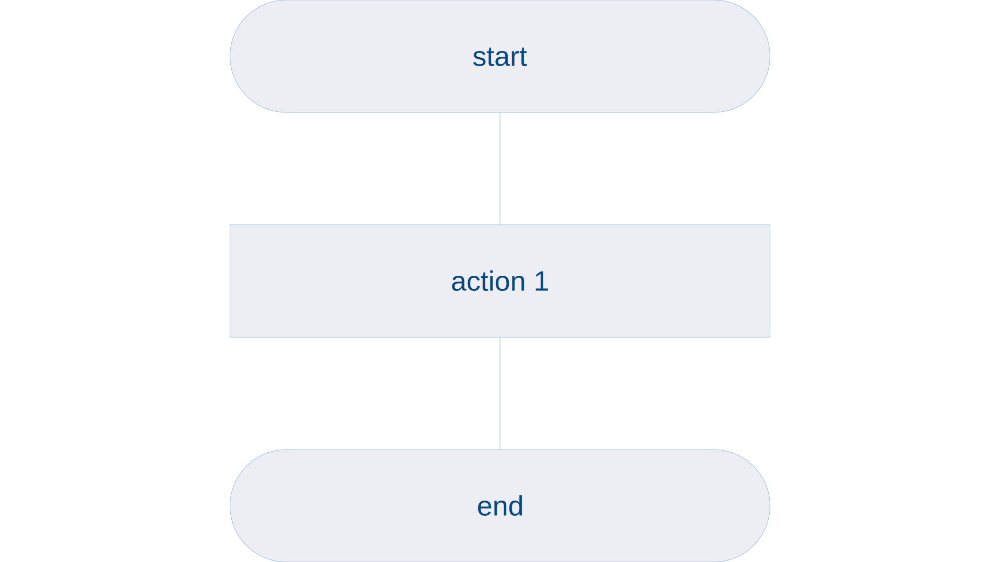
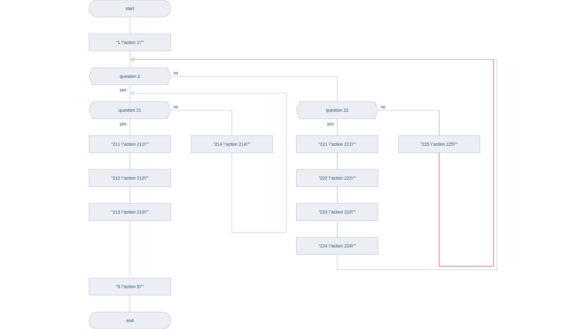

# wyvern


Simple flowchart diagrams. Inspired by DRAKON.


## goals

* no ambiguity in produced flowcharts
* simple flowchart syntax
* code easy to build and run

## constraints

* connections never cross
* connections are comprised only of horizontal and vertical lines
* default direction: top-to-bottom
* deterministic: input A will always produce output B

## examples

Wyvern uses plain text files as input, extensions are not relevant. You can copy and paste the examples below to individual files with no alterations.

<table>
<tr>
<td> code </td> <td> rendered flowchart </td>
</tr>
<tr>
<td>

```
1 "action 1"
```

</td>
<td>



</td>
</tr>
<tr>
<td>

```
1 "action 1"
2 "action 2"
3 "action 3"
```

</td>
<td>


</td>
</tr>
<tr>
<td>

```
a1 "action 1"
a2 "action 2"
q1 "question 1"
{
    a2a "action 2a"
}
{
    a2b "action 2b"
}
a3 "action 3"
```

</td>
<td>


</td>
</tr>
<tr>
<td>

```
1 "action 1"
2 "question 2"
{
  21 "question 21"
  {
    211 "action 211"
    212 "action 212"
    213 "action 213"
  }
  {
    214 "action 214"
    21
  }
}
{
  22 "question 22"
  {
    221 "action 221"
    222 "action 222"
    223 "action 223"
    224 "action 224"
  }
  {
    225 "action 225"
    22
  }
  2
}
5 "action 5"
```

</td>
<td>



</td>
</tr>
<tr>
<td>

```
h1 "headline 1"
{
    "action 1"
    "action 1 a"
    "action 1 b"
    h2
}
h2 "headline 2"
{
    "action 2"
    "action 2a"
    "action 2b"
    h3
}
h3 "headline 3"
{
    "action 3"
    "action 3a"
    "action 3b"
    "action 3c"
    "action 3d"
    h4
}
h4 "headline 4"
{
    "action 4"
    "action 4a"
    h5
}
h5 "headline 5"
{
    "action 5"
}
```

</td>
<td>


</td>
</tr>
</table>

## terminology

* `start/end terminator` - consecutively, start and end blocks of any diagram
  * code: not represented in the code
* `action block` - basic building block of any diagram, illustrating an individual action
  * code:
    ```
    [action id] "caption"
    ```
* `fork block` - a yes/no questions starting two branching paths:
  * `yes` - default direction - down, the preferred outcome
  * `no` - the alternative outcome, not as optimal. The no branch can optionally end with an id of another block on the fork skewer forming a gamma connection.
  * code:
  ```
  [fork id] "caption"
  {
    ... yes branch ...
  }
  {
    ... no branch ...
    [gamma connection id]
  }
  ```
* `gamma connection` - line connecting no branch with another block placed on fork's skewer - it can either be the fork id itself or a block preceding the fork, provided that would not cause any connections to clash.
* `skewer` - vertical line on which blocks are placed in linear progression. Each fork block has the ability to introduce an alternative/no path which eventually merges back into the skewer on which their fork block is placed. The merging point can be placed in three different locations:
  * immediately after the fork block from which it originates
  * the fork block from which it originates forming a loop
  * before the fork block from which it originates forming a loop - the thing to note here is these connections are not restricted (yet) and it is possible to formulate a loop where connections cross. This is going to be addressed in future releases of the code as lines should never cross and the library should be able to enforce it by validation or syntax.
* `headline block` - a block serving as an identifier of a skewer grouping a sequence of blocks.
* `address block` - a block concluding a skewer grouping a sequence of blocks and containing the identifier of a headline block which we should visit next when following the flowchart.
  * code:
    ```
    [headline id] "caption"
    {
      ... skewer blocks ...
      [address id] ... id of another headline
    }
    ```
* `primitive diagram` - a diagram which only leverages blocks of type:
  * `start/end terminator`
  * `action block`
  * `fork block`
* `silhouette diagram` - a diagram which contains the same types of block as the `primitive diagram` but which can also contain `headline blocks` and `address block`.

In primitive diagrams, blocks are arranged in a linear fashion: action C follows action B and action B follows action A (think 1D list of blocks).

In silhouette diagrams, `headline blocks` and `address blocks` divide the diagrams into individual skewers/smaller tasks that can be represented as a sequence of blocks (think 2D list of blocks).

## how to compile

* prerequisites:
  * ghc
  * cabal
    * alex
    * happy
    * hlint
    * ormolu

For local installation, [ghcup](https://www.haskell.org/ghcup/) is the most reasonable choice on amd64 machines.

Simply execute:

```bash
./build.sh
```

## how to run

Having compiled the project, simply execute:

```bash
cabal run wyvern-diagrams -- -i "./diagram.txt" -o "./diagram.svg"
```

Or, to see some sample diagrams, execute:

```bash
./run.sh
```

## how to test

Having compiled the project, simply execute:

```bash
./test.sh
```

### debugging

* `cabal repl wyvern --repl-options="-fbreak-on-error -fbreak-on-exception"`
* `:load app/Main`
* `:break Blocks 365`
* `:main -i "./diagrams/simple-diagram-1.txt" -o "./diagrams/simple-diagram-1.svg"`

## resources

### community

* [youtube](https://www.youtube.com/@sitsuj)

### DRAKON

DRAKON is wyvern's big brother - more complex, steeper learning curve, more terms, more rules.

* [drakon whitepaper](https://drakon.su/_media/video_i_prezentacii/graphical_syntax_.pdf)

* [drakon wiki](https://en.m.wikipedia.org/wiki/DRAKON)

* [drakon.su](https://drakon.su/start)

* [drakon](https://drakonhub.com/read/docs)

### haskell

* [ghcup](https://www.haskell.org/ghcup)

* [diagrams](https://archives.haskell.org/projects.haskell.org/diagrams/doc/quickstart.html#introduction)

* [diagrams - user manual](https://archives.haskell.org/projects.haskell.org/diagrams/doc/manual.html)

* [alex](https://haskell-alex.readthedocs.io/en/latest/index.html)

* [lexing with alex](https://serokell.io/blog/lexing-with-alex#our-first-lexer)

### colours

* [colours](https://www.colourlovers.com)

* [colorkit](https://colorkit.co/)

  * [default palette](https://colorkit.co/palette/642915-963e20-c7522a-e5c185-fbf2c4-74a892-008585-006464-004343/)
