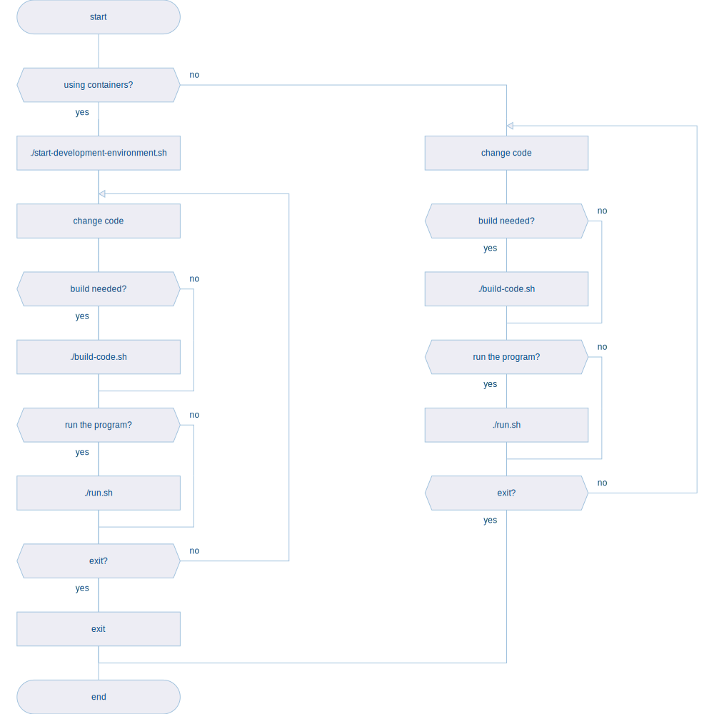

# wyvern

<table>
  <tr>
    <td></td>
    <td>
      Simplified version of DRAKON diagramming language.
         
      For a more faithful implementation of DRAKON, please visit: <a href="https://github.com/PiotrJustyna/drakon-renderer">PiotrJustyna/drakon-renderer</a>.
    </td>
  </tr>
</table>

## constraints

* only straight lines - no diagonal or curved lines, etc.
* main direction: top-to-bottom, loopbacks possible
* no arrows (direction is known and default) except loopbacks
* default path on the main skewer - the further to the right, the less ideal the scenario
* deterministic: input A will always produce output B

## development environment

<table>
  <tr>
    <td></td>
    <td>
      The preferred way to work with wyvern is in containers. All scripts/commands described below will work directly on your hardware (not necessarily in a container), but the indended usage is in-container.
    </td>
  </tr>
</table>

| command | description |
| --- | --- |
| `./start-development-environment.sh` | starts a fully dockerized development environment |
| `./build.sh` | builds and lints code |
| `./run.sh` | runs code |
| `./format.sh` | formats all `*.hs` |
| `exit` | terminates development environment |

## community

* [youtube](https://www.youtube.com/playlist?list=PL9-WsOrOzOxSqWNqzhzyBGZsN0sOxEF6Q)

## resources

### DRAKON

DRAKON is wyvern's big brother - more complex, steeper learning curve, more terms, more rules.

* [drakon-renderer](https://github.com/PiotrJustyna/drakon-renderer) - DRAKON diagrams renderer. This is where my adventure with DRAKON started. Wyvern is intended to be a very simplified, easier to fully grasp version of DRAKON.

* [drakon whitepaper](https://drakon.su/_media/video_i_prezentacii/graphical_syntax_.pdf)

* [drakon wiki](https://en.m.wikipedia.org/wiki/DRAKON)

* [drakon.su](https://drakon.su/start)

* [drakon](https://drakonhub.com/read/docs)

### haskell

* [diagrams](https://archives.haskell.org/projects.haskell.org/diagrams/doc/quickstart.html#introduction)

* [diagrams - user manual](https://archives.haskell.org/projects.haskell.org/diagrams/doc/manual.html)

* [alex](https://haskell-alex.readthedocs.io/en/latest/index.html)

* [lexing with alex](https://serokell.io/blog/lexing-with-alex#our-first-lexer)

### colours

* [colours](https://www.colourlovers.com)

* [colorkit](https://colorkit.co/)

  * [default palette](https://colorkit.co/palette/642915-963e20-c7522a-e5c185-fbf2c4-74a892-008585-006464-004343/)
